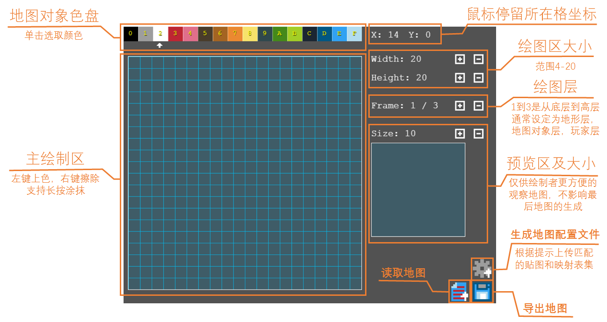

# How TO Make A Whole Game

[视频讲解](/how-to-make-video)

## 1. 下载项目 

[download ZIP](https://github.com/SuCicada/Algorithm-PlayGround/archive/master.zip)

or use git on terminal 

```
git clone https://github.com/SuCicada/Algorithm-PlayGround.git
```

## 2. 文件主要结构
    APG
    ├── dist     （集成库）
    │   └── APG.js 
    ├── docs     （文档）
    │   └── ...
    ├── Examples （样例）
    │   └── ...
    ├── lib      （外部库）
    │   └── phaser-2.13.2.min.js
    └── src      （源码）
        ├── APG  （APG引擎）
        │   ├── APG-core.js
        │   ├── Assets.js
        │   ├── Bag.js
        │   ├── Character.js
        │   ├── Game.js
        │   ├── Group.js
        │   ├── Methods.js
        │   ├── Sprite.js
        │   ├── Target.js
        │   ├── Tile.js
        │   └── Update.js
        └── MapEditor （地图编辑器）
            ├── GenerateMapJson.js
            ├── index.html
            └── MapEditor.js

 
---
## 3.地图制作

MapEditor包含文件
* GenerateMapJson.js
* MapEditor.js
* index.html

### 3.1 绘制地图


使用任何工具打开 `index.html`, 或者使用在线编辑器 [APG MapEditor](https://sucicada.github.io/Algorithm-PlayGround/src/MapEditor/index.html)

在打开的画板上绘制.
#### 快捷键：
    0-9,A,B,C,D,E,F：选择对应颜色。
    S：保存
    P：切换颜色效果（仅编辑器的视觉效果改变，对保存的地图无影响）
    X：快速清空当前层
    上下左右(方向键)：移动当前层的地形

### 3.2 导出地图数据(mapData)(可选)
点击导出按钮,导出文件名形如 xxx - mapdata.json 的地图数据文件.

形如：
```json
{
    "width": 2,    
    "height": 3,
    "map": [
        [[".","1"],[".","1"],[".","1"]],
        [[".","1"],[".","1"],[".","1"]],
        [[".","1"],[".","1"],[".","1"]]
    ]
}
```

### 3.3 创建地图映射表 (blockMap)
创建js, 映射表js的格式参见[blockMap 地图元素映射表](/block-map?id=blocks)

### 3.4 生成地图配置文件 (TileMapJson)
点击生成按钮, 选择 `3.3`中的地图映射表, 会导出文件名形如 xx - MapTile.json 的 tilemap 配置文件. <br>
关于tilemap详情参见[tilemap官方版](http://doc.mapeditor.org/en/stable/reference/json-map-format/), 或者 [tilempa汉化版](https://docs.qq.com/doc/DRWladWVHTmhQdFBr)

### 3.5 附加功能: 导入地图数据
需要在**第一层地**图层上点击导入,选择 `1.2`中导出的地图数据即可.

### 3.6 *程序说明: GenerateMapJson.js
+ 地图生成器, 分为4部分:

| | | 补充|
| :--- | --- | ---|
|generate_tilemap_data|定义tilemap_data 外层框架|
|setMapTilesets| 定义 tileset 层|需要首先完成
|setMapLayerData| 定义 layer 层| `setMapTilesets` 之后即可
|setProperties| 定义 元素自定义属性| 
|setMapObjects| 定义对象层,<br> 组合layer 和object | `setMapTilesets` 之后即可

+ 文件选择器

|||
| --- | ---|
|showWindow| 显示窗口
|getImgInfo| 读取图片大小|
|mapConfigImport|导入映射表js|
---


## 4.制作游戏 

### 4.1 修改游戏配置文件
样例目录下有一个名为 config.js 的文件,里面有自定义的游戏的所有配置,包括渲染模式, 窗口大小, 全屏, 以及所有需要用到的资源文件. <br>
详情参见[config-js-Format](/config-js-Format?id=config-js)

### 4.2 创建 index.html
需要引入以下 JavaScript 文件:

| js文件 | 描述 |
|---|---|
|phaser.js| phaser官方库 |
|config.js| 游戏配置文件 |
|YourGame.js| 你的游戏代码|   
|APG.js| APG游戏引擎|

#### 注意:
+ 四个js文件的引用顺序可以随意.
+ 除此之外,html其他部分可以什么也不写.

+ 不要忘了js支持库,如果不想使用js库在你的服务器上,或者想保持最新版的APG,可以使用在线库.

    + APG
```html
<script src="https://sucicada.github.io/Algorithm-PlayGround/dist/APG.js"></script>
```

    + PhaserCE
```html
<script src="//cdn.jsdelivr.net/npm/phaser-ce@2.13.2"></script>
```

### 4.3 加入游戏相关资源
游戏相关资源比如,元素贴图,帧动画JSON,背景图片,地图贴图,地图配置文件(详见[3.地图制作](#_3地图制作)),背景音乐等.

### 4.4 开始编写游戏脚本

整个游戏的结构

```js
YourGame = {   
    create:{...},   /* 用来进行一些对象的创建及初始化 */
    update:{...},   /* 游戏主循环*/
};
```

我们使用Demo3*中缀表达式转后缀表达式*来举例说明，其中的地图和资源文件可以直接从`Examples`中获取，咱们接下来只关心怎么写游戏脚本。

#### create 游戏初始
create部分负责，初始`TextBitMap`（文本块），玩家操作（按键绑定），初始碰撞检测以及触发规则，自定义属性变量，初始元素动画

##### 生成组对象
+ 生成元素或角色组对象

获得`target`组，或者`Character`组，前提是这些元素都已经在[游戏配置文件](/config-js-Format.md)中配置过，
```js
baoshis = getTargetGroup("baoshi");     /* 得到宝石组*/  
player = getCharacterGroup('player');   /* 得到玩家组*/
```
如果你得到的元素是`TextBitMap`类型，并且想要重新给元素定义文字和背景，请这么写
```js
textbitmap = getTargetGroup("numblock");
loadTextBitMap(textbitmap,"12",'#000000');
``` 

##### 特效
+ 音乐播放

```js
APG.Assets.playMusic('mu');
```

+ 载入玩家移动动画

每个方向的值需要对应你给玩家设置的精灵帧贴图中的帧id。
```js
playerMoveAnimations(player,{
    /* 方向(大写,或小写 -> frames 或单个数字*/
    right: 0,
    LEFT: [1],
    down: [2],
    up: 3,
});
```

+ 元素持续动画
```js
setAnimations(this.baoshis, 'rotation', null, 6, true);
```

##### 碰撞检测
+ 碰撞不可通行
```js
blockGroupOverlap(this.player, this.walls);
```

+ 边境检测
```js
setCollideWorldBounds(false);
```

+ 碰撞触发
```js
activeGroupOverlap(this.player, this.baoshis, this.getBaoshi, null, this);
```

##### 按键
+ 更改移动按键，默认为上下左右
```js
setMoveKey('up','UP');
```

+ 设置按键事件
```js
addKeyEvent('D', this.putXinbiao, null, this);
```

#### update 
游戏主循环，周期循环执行

##### 角色移动检测触发机制
```js
characterMoveEvent(this.player, null, this.dropDaolu, [site], null, null, this);
```

##### 自定义规则
+ 得到玩家坐标进行操作、判断
```js
site = getCharacterSite(this.player);
if(site.x == 10 && site.y == 10){
    /* (10,10) 坐标时发生*/
    ...
}
```

+ 判断玩家当前所处瓷砖是什么，然后触发某些操作
```js
/* 如果玩家所处瓷砖存在或瓷砖id为2，则重启游戏*/
tile = getCharacterTile(this.player);
if(!tile || APG.Tile.getTileId(tile)==2){
    APG.Game.restartGame();
}
```

+ 判断条件成立改变元素动画
```js
/* 如果背包满了，出口就切换亮的动画帧，否则就是暗的*/
if(getBagSize() == getBagCapacity()){
    setAnimations(this.exports, 'light', [1]);
}else{
    setAnimations(this.exports, 'dark', [0]);
}
```

#### 自定义操作函数
可以自己随意写可用的函数，主要用于回调以及代码耦合

可接收回调的函数
+ WIN
+ LOST
+ addKeyEvent
+ characterMoveEvent
+ blockTileOverlap
+ blockGroupOverlap
+ activeGroupOverlap
+ activeTileOverlap 
